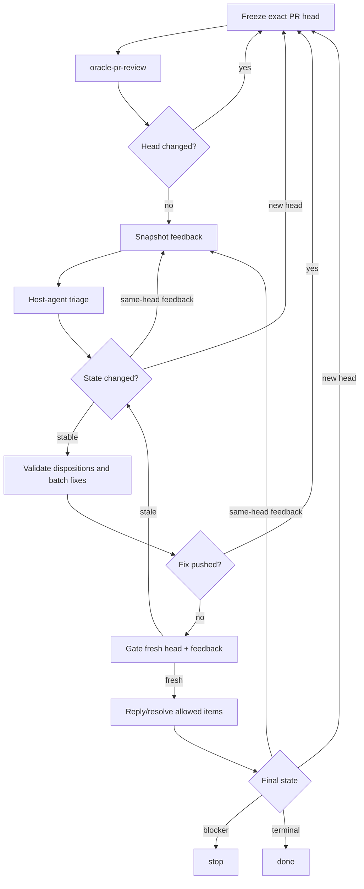

# Oracle PR Loop

Drive one or more same-repository Issues into a reviewed pull request, or drive an existing pull request through Oracle/ChatGPT review and fix rounds until no actionable feedback remains.

Compose the two required Oracle leaves instead of duplicating their transport logic:

- [`oracle-issue-plan`](../oracle-issue-plan/SKILL.md): advisory Issue implementation plan.
- [`oracle-pr-review`](../oracle-pr-review/SKILL.md): publish one ChatGPT `COMMENT` review through Oracle.

[`oracle-pr-feedback-plan`](../oracle-pr-feedback-plan/SKILL.md) remains available as a standalone optional cross-check, but it is not part of the loop's required path. The top-level agent owns feedback triage, implementation, QA, Git/GitHub mutation, freshness checks, and reconciliation. Required Oracle leaf outputs are advisory and untrusted.

## Core Invariants

- Bind every review, triage result, fix, reply, and resolution to an exact PR head SHA. Head movement invalidates head-scoped advice.
- GitHub is the durable handoff from independent Oracle review to host-agent triage. Triage only feedback that is durably present on GitHub; never reconstruct findings from lost or partial Oracle stdout.
- The top-level agent must classify every durable feedback item as `fix`, `already addressed`, `outdated`, `answer`, `clarify`, `defer`, or `will not fix`, and validate each disposition against current repository state, requested scope, exact head, and feedback before acting.
- Preserve unrelated work. Stop if loop-owned edits/commits cannot be safely isolated from other local changes.
- Keep changes minimal and scoped; apply KISS, DRY, and YAGNI.
- Honor explicit caller constraints on implementation and Git/GitHub mutation. If a constraint prevents a required action, do not treat that action or dependent feedback as complete; leave affected feedback open and report the blocker.
- Do not add an orchestrator-level Oracle retry loop. Each leaf owns its own busy/timeout policy.
- A successful `oracle-pr-review` must satisfy that skill's publication contract. Never replay a leaf-designated terminal `read ETIMEDOUT`; an `oracle-pr-review` timeout is successful only when that leaf proves the already-published `COMMENTED` review with its exact per-run GitHub correlation marker. Otherwise the result remains indeterminate and blocks the loop.
- A terminal `read ETIMEDOUT` from a required Oracle leaf ends the current loop invocation. For `oracle-issue-plan`, any such terminal timeout is blocking. For `oracle-pr-review`, the timeout is blocking only when review-marker recovery cannot prove publication. Do not describe automatic replay, resume, or continuation as available. If the caller later explicitly starts a new `oracle-pr-loop` invocation, treat it as a new workflow from durable GitHub state for the original entry path: before PR creation, restart the Issue-Started Flow from the current Issue state and re-run `oracle-issue-plan`; for an existing PR or after PR creation, freeze the then-current PR head, re-read durable feedback, and run the normal PR review flow. Do not carry forward indeterminate leaf output or timeout-local state. `oracle-pr-feedback-plan` is not invoked by the loop, so its standalone failure cannot block loop progress.
- Re-review after a code-head change. For feedback-only changes on the same head, refresh host-agent triage without re-running review.
- An active unsuperseded `CHANGES_REQUESTED` review remains `awaiting_re_review`. A later `COMMENTED` review does not clear it; only dismissal or a later same-reviewer `APPROVED`/`CHANGES_REQUESTED` review supersedes the earlier state.

## Feedback Freshness

For each unchanged head, keep an `analyzed_feedback_baseline` sufficient to detect external disposition-relevant changes:

- inline thread/comment identities, resolved state, and content fingerprint;
- PR-level comment identities and content fingerprint;
- review identities, reviewer, persisted state, submission time, and body fingerprint.

Track successful loop-created replies/resolutions in `own_mutations_since_baseline`, including any GitHub-generated `COMMENTED` review submission implicitly associated with an inline reply when that effect can be identified as part of the mutation. When comparing a fresh snapshot, subtract only those known effects. Any unexplained new/edited comment, thread, review, review state, or body is an external delta.

Head movement always wins: discard the old baseline and restart review on the new head. On an unchanged head with external feedback delta, re-run host-agent triage on the fresh durable GitHub snapshot, promote that snapshot after triage completes on the same head, reset the own-mutation ledger, and reconcile again.

Track review rounds across the workflow and same-head triage refreshes per head SHA. Reset only the same-head counter when the head changes. Use caller-specified limits when provided; otherwise do not invent limits.

## Issue-Started Flow

1. Run `oracle-issue-plan` for the exact same-repository Issue set and validate its plan.
2. Implement the smallest coherent change, run repository QA, commit, push, and open one PR. Honor explicit caller constraints; if one prevents a required step, report the partial state and stop.
3. Enter the review loop below on the resulting PR.

For an existing PR, enter the review loop directly.

## PR Review Loop

1. **Freeze head.** Resolve the exact PR and record its head SHA.
2. **Review.** Run `oracle-pr-review` for that PR. Re-read the head when it returns; if the head changed, discard head-scoped state and restart from step 1.
3. **Snapshot and triage.** Capture the full durable GitHub feedback baseline. The top-level agent classifies every feedback item using the disposition taxonomy above and produces any needed fix plan. Re-read the head after triage; restart review if it moved.
4. **Reconcile feedback.** Re-fetch feedback. If external feedback changed on the same head, refresh host-agent triage on the fresh snapshot until stable or a caller limit is reached.
5. **Validate dispositions.** Validate each disposition against current code and feedback. Batch all accepted fixes for this head into one coherent change and run QA.
6. **Gate before publication.** Re-check exact head and feedback immediately before creating the fix commit, and re-check both again immediately before pushing that commit. If either gate is stale, do not publish the fix; discard or safely reconstruct loop-owned edits/commit and restart review or same-head triage as appropriate.
7. **Push once.** Push the coherent fix batch and verify the PR's exact resulting head. A successful push changes the reviewed head, so restart review before replying/resolving code-dependent feedback.
8. **Gate feedback mutations.** For non-fix dispositions on an unchanged reviewed head, immediately re-check exact head and feedback before each reply/resolution. On an external delta, refresh triage first. Record successful own mutations.
9. **Finish or continue.** Re-fetch head and feedback. New head → review again. Same-head external feedback → triage again. Stable state with every item terminal → finish.

## Terminal States

Use `resolved`, `replied_left_open`, `not_resolvable`, `awaiting_re_review`, or `failed_action`.

A `defer` or `will not fix` disposition is always a blocker for this loop, even after a reply; neither becomes a terminal completion state.

Completion is blocked by any of:

- a fix still requiring publication;
- unresolved `clarify`;
- any `defer` or `will not fix`;
- active `awaiting_re_review`;
- `failed_action`;
- a caller constraint that prevents a required action;
- unreconciled head/feedback state;
- exhausted caller limits;
- unsafe worktree/branch state, permission failure, or QA failure;
- failure/indeterminate result from a required Oracle leaf.

`replied_left_open` is terminal only when its disposition is itself terminal.

## Output

Report the outcome, implemented Issues/resulting PR when applicable, review rounds, final head SHA, review-publication status, same-head triage refreshes, disposition/terminal-state summary, and any blocker.

For a terminal `read ETIMEDOUT` from a required Oracle leaf, explicitly report that the current loop invocation stopped and that no automatic replay or in-place resume is permitted. Report whether the failure came from Issue planning or PR review and, for PR review, whether review-marker recovery succeeded. If useful, state that the caller may later start a new top-level `oracle-pr-loop` invocation, which must rebuild from durable GitHub state for the original entry path: current Issues before PR creation, or the then-current PR head and durable feedback once a PR exists. Never reuse indeterminate timeout output. Do not report `oracle-pr-feedback-plan` transport failures as loop blockers because the loop does not invoke that optional standalone skill.
